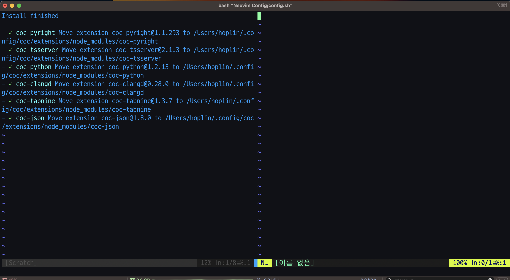
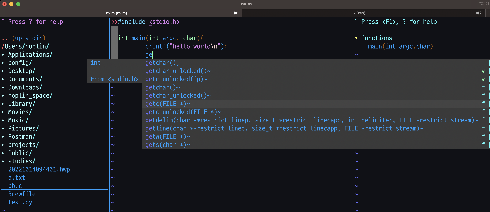

Neovim Config
===

Neovim Config script for Mac OS. Run command under below for installation and configuration

```bash
# If you are in directory of My-MacOS-Config/Neovim Config

bash config.sh
```

After all of Coc installation finished like photo below, press `<F4> + Enter` to exit Neovim and restart it!



## Intelli Sense Supported languages

- C/C++
- Python
- Node.js
- TypeScript

## Shortcuts

- `<F4>` : `:qa!`, exit vim
- `<F5>` : `gg=G`, auto indent code
- `<F6>` : `:edit`, open new file with specify directory as argument
- `<F7>` : `:e`, open new file with argument(file name)
- `<F8>` : `:TagbarToggle`, Open tagbar
- `<F9>` : `:NERDTreeToggle`, Open nerdtreetoogle
- `<F10>` : `:terminal`, Execute command in terminal
- `Control + y` : Autocomplete Suggestion

## Plugins

List of plugin as default installation

```vim
" tree explorer
Plug 'preservim/nerdtree'
" Local git repository
Plug 'Xuyuanp/nerdtree-git-plugin'

" tag displayer
Plug 'preservim/tagbar'

Plug 'vim-airline/vim-airline'
Plug 'neoclide/coc.nvim'

" Rainbow Bracket
Plug 'frazrepo/vim-rainbow'
```
