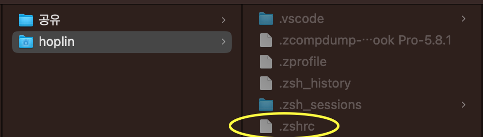

My Mac OS Config
===
***
## 페이지 목차

[💍 1. 현재 사용하고 있는 맥 & 악세서리](#1-현재-사용하고-있는-맥--악세서리)

[🛒 2. App Store에서 설치한 앱들](#2-app-store에서-설치하는-앱들)

[💻 3. 사용하는 툴들](#3-사용하는-툴들)

[🧑‍💻 4. 사용하는 Extension & Tools](#4-사용하는-extension--tools)

[🛠️ 5. 개발환경 설정하기](#5-맥-개발-환경-기본-설정값필자)

[🔧 6. Utility Scripts](#6-utility-scripts)

[🔧 7. Neovim Configuration](#7-neovim-configuration)
***
## 1. 현재 사용하고 있는 맥 & 악세서리

- Macbook Pro 
    - CPU : Apple Silicon(M1)
    - RAM : 16 GB
    - SSD : 512 GB

- Mac Mini
    - CPU : Apple Silicon(M1)
    - RAM : 16 GB
    - SSD : 256 GB

- Keyboard
    - [Apple Magic Keyboard](https://www.apple.com/kr/shop/product/MUF82KH/A/usb-c-digital-av-multiport-어댑터?fnode=ed4f386342d0c23794045c10050074fb4f55e9eb2a9604d08c334cc0183600fabf93ed5b3c9069f6034eb62c9b80e11399579e2cc5ee18a0850e325689b74a98fa145234ab9693d6cfd8e54ff4758fb67bbcfd3e6936ca3a75667abb1c4fc7a8)
- Mouse
    - [Apple Magic Trackpad](https://www.apple.com/kr/shop/product/MMMP3KH/A/magic-trackpad-블랙-multi-touch-표면?fnode=ed4f386342d0c23794045c10050074fb4f55e9eb2a9604d08c334cc0183600fabf93ed5b3c9069f6034eb62c9b80e11399579e2cc5ee18a0850e325689b74a98fa145234ab9693d6cfd8e54ff4758fb67bbcfd3e6936ca3a75667abb1c4fc7a8)
    - [Logitech MX Master3](https://www.coupang.com/vp/products/6424801973?itemId=13839332791&vendorItemId=81089457861&src=1042503&spec=10304991&addtag=400&ctag=6424801973&lptag=10304991I13839332791&itime=20230104014521&pageType=PRODUCT&pageValue=6424801973&wPcid=16727643210126688292838&wRef=&wTime=20230104014521&redirect=landing&gclid=CjwKCAiAwc-dBhA7EiwAxPRylNy05Xo4UgpwIM8jcxopt-5pbdQewMHWUnAJSdUkoTd4-YRf6a8XghoCEjQQAvD_BwE&campaignid=18860235808&adgroupid=&isAddedCart=)
- External Moniter
    - [LGE 32UN650](https://www.googleadservices.com/pagead/aclk?sa=L&ai=DChcSEwjKwrO67Kv8AhX32kwCHQGjDsUYABARGgJ0bQ&ae=2&ohost=www.google.com&cid=CAESauD2wG5Ub8Pgju4HreO7Keg2-5RTjETgsq948JS72o6_zt2cHlhZUe2zD5ermSfyIYWjZqdpqIr4FtOvbN_0MP_WX5pQB-FrbdzSuHvKKLoyZ87T11UQR_aOroFOXO4oPh3Hy1vDce_kS0I&sig=AOD64_3oPz1lwWQYFhjU2MaXpACXFUpmZA&q&adurl&ved=2ahUKEwiAha267Kv8AhVXyGEKHXM2Cd8Q0Qx6BAgIEAE&nis=8&dct=1) (4K, 60Hz, UHD)

- Hub
    - [Apple Multiport](https://www.apple.com/kr/shop/product/MUF82KH/A/usb-c-digital-av-multiport-어댑터?fnode=ed4f386342d0c23794045c10050074fb4f55e9eb2a9604d08c334cc0183600fabf93ed5b3c9069f6034eb62c9b80e11399579e2cc5ee18a0850e325689b74a98fa145234ab9693d6cfd8e54ff4758fb67bbcfd3e6936ca3a75667abb1c4fc7a8)

[Back to top](#페이지-목차)
***
## 2. App Store에서 설치하는 앱들

1. Magnet : 윈도우에서는 화면 분할을 지원하지만, 맥에서는 윈도우에서처럼의 화면 분할이 자유롭지 못합니다. Magnet은 화면분할을 윈도우처럼 할 수 있도록 도와줍니다.

2. Run Cat : 상단바에 CPU 점유율에 따라 뛰는 고양이가 생깁니다

3. Hidden Bar : 상단바에 정보가 너무 많은 경우, 일부 숨겨주는 앱입니다

4. Good Note5 : iPad에서 필기한 내용을 보기위해 설치했습니다

5. XCode : 취미로 가끔 Swift 해볼때 사용합니다

[Previous](#1-현재-사용하고-있는-맥--악세서리)

[Back to top](#페이지-목차)
***
## 3. 사용하는 툴들
- Editor
    - Jetbrains
        - IntelliJ Ultimate
        - Pycharm Professional
        - Goland
        - WebStorm
        - CLion
        - Jetbrain Toolbox
    - Visual Studio Code
    - XCode
- Messenger
    - Slack
    - Discord
- Virtualize
    - Docker Desktop
    - Podman Desktop
- SQL
    - Table Plus
- API Testing
    - Insomnia
    - Postman
- ETC
    - Notion
    - Neovim

[Previous](#2-app-store에서-설치하는-앱들)

[Back to top](#페이지-목차)
***
## 4. 사용하는 Extension & Tools

### [Visual Studio Code extension](./VS-Code-Config/) 일괄 설치하기

```bash
bash VS-Code-Config/extension.sh
```

### [Brew extensions](./Brewfile/) 일괄설치

**HomeBrew 설치 이후에 가능합니다**

```bash
brew bundle --file=./Brewfile/Brewfile
```

[Previous](#3-사용하는-툴들)

[Back to top](#페이지-목차)
***
## 5. 맥 개발 환경 기본 설정값(필자)

### 1,2,3,4의 과정은 [src/homebrew.sh](src/homebrew.sh)에 위치한 스크립트를 실행하여도 괜찮습니다. 단 초반 설치시 설치과정에서 2번의 상호작용이 요구됩니다.

1. Homebrew 설치하기

- Homebrew란 Mac OS에서의 패키지 관리자입니다. 우분투에서 `apt`, CentOS 혹은 RHEL 에서 `yum` 이 있듯이 말이죠. 

```bash
/bin/bash -c "$(curl -fsSL https://raw.githubusercontent.com/Homebrew/install/HEAD/install.sh)"
echo '# Set PATH, MANPATH, etc., for Homebrew.' >> /Users/$(whoami)/.zprofile
echo 'eval "$(/opt/homebrew/bin/brew shellenv)"' >> /Users/$(whoami)/.zprofile
eval "$(/opt/homebrew/bin/brew shellenv)"
```

2. Oh-My-ZSH 설치하기
- Mac OS의 기본 Shell은 [`ZSH`](https://github.com/ohmyzsh/ohmyzsh) 입니다. 이는 Mac OS 10.15인 Catalina 기준으로 변경되었습니다.

- ZSH의 장점에는 아래와 같은 것들이 있습니다
    1. 가독성 증가
    2. 자동완성 기능
    3. Git status 확인하기 좋음
    4. 경로 추정 가능
    5. Bash와의 호환성

- Oh-My-ZSH는 ZSH에 추가적인 기능을 붙일 수 있는 기능을 하게끔 해주는 플러그인입니다. 설정에 따라 터미널 가독성을 높일 수 있고, 그에따른 생산성 또한 높아집니다.

```bash
sh -c "$(curl -fsSL https://raw.github.com/robbyrussell/oh-my-zsh/master/tools/install.sh)"
```

3. Iterm2 설치하기

- Iterm2 또한 터미널 애플리케이션중 하나입니다. 기본 터미널보다 더 다양한 플러그인, Key Binding을 지원하며 무엇보다 기본 터미널에서는 지원하지 않는 tty분할 기능도 지원합니다

```bash
brew install iterm2
```

- 위 명령어를 실행하면 Launchpad에 Iterm2 애플리케이션이 생성되었을겁니다.

4. zshrc 설정변경하기, 

- 아래와 같이 설정해 주기위해서는 추가적인 설정이 필요합니다

    

- ZSH 설정파일을 열기 위해서는 아래 명령어를 입력해야합니다. 이 명령어의 의미를 조금 알려드리자면, `open`은 Mac OS에서 파일을 열거나, 해당 디렉토리를 Finder로 열 수 있게 해주는 Mac OS 명령어입니다.(매우 유용합니다) `~`는 Mac OS를 로그인한 사용자의 Working Directory를 의미하고, `.zshrc`는 ZSH 설정파일을 의미합니다. 다만 `.zshrc` 파일은 그냥 보이지 않습니다. UNIX/Linux 계열에서 `.`으로 시작하는 파일 및 디렉토리들은 모두 숨김처리가 됩니다. 숨김파일을 보기 위해서는 `command + shift + .`을 눌러줍니다. 그러면 아래 사진과 같이 숨김처리된 디렉토리나 파일이 보입니다.

    ```bash
    open ~/.zshrc
    ```

    

- 자 이제 ZSH 설정파일을 엽니다. 그 다음 아래와 같이 ZSH_THEME을 `agnoster`로 변경해줍니다. `command + S`로 변경을 저장해주고 Iterm2를 껏다 켜줍니다

    

5. Font 설치 **"여기서부터는 Iterm2로"**

- 폰트는 기본 폰트를 사용해도 좋습니다. 다만, 가독성을 위해 다른 폰트를 사용하기도 합니다. 저같은 경우, 세가지를 선호합니다.

    1. Hacker Font(Mac 기본용) : https://sourcefoundry.org/hack/

    2. Naver D2 Coding(Mac 기본용, 현재사용중) : https://github.com/naver/d2codingfont

    3. Fira Code(Visual Studio Code용, 연산자 기호 가독성을 높여줌) : https://github.com/tonsky/FiraCode

- 폰트 설치하는법은 간단합니다. 폰트 zip 파일을 푸시고, 설치하고자하는 폰트 파일들을 모두 드래그한 뒤 클릭하시고, 설치하시면 됩니다.

    

6. Iterm2에 적용하기

- 설치한 폰트를 Iterm2에 적용해 보겠습니다. Iterm2 Setting으로 들어가 줍니다

    

- `Profile - Text - Font`란에서 지정하고자 하는 폰트로 바꿔줍니다

    

- **주의할 점은 디폴트 터미널에서도 동일하게 폰트를 바꿔주어야 합니다.(깨짐 방지)**

    

- 만약에 위 과정을 모두 진행했는데도, Iterm2에서 아래와 같이 물음표가 생긴다면, 아래 과정을 진행해주세요([src/iterm2crackfix.sh](src/iterm2crackfix.sh))를 실행해 주셔도 괜찮습니다. Iterm2를 재실행해 주시고, 그래도 안된다면, 선택한 폰트를 잠시 다른폰트로 바꿨다가 다시 사용할 폰트로 바꾸고 재실행해주세요

    

    ```bash
    git clone https://github.com/powerline/fonts.git --depth=1

    cd fonts

    ./install.sh

    cd ..

    rm -rf fonts
    ```

7. Iterm2 컬러 프리셋 변경하기

- Iterm2 색상 프리셋을 변경해 줄 수 있습니다. 우선 이 [링크](https://iterm2colorschemes.com) 로 가줍니다.
- 스크롤을 하다 보면 되게 많은 컬러 프리셋이 있는것을 알 수 있습니다. 원하는 프리셋의 제목을 클릭해주면 아래와 같이 XML형식의 텍스트가 나옵니다.
- 우클릭을 하시고, `페이지 소스 별도 저장`을 클릭해줍니다.

    

- 다운로드한 경로를 가면 아래와 같이 `~~itercolors.txt`로 되어있을겁니다. 여기서 뒤의 `.txt`를 지워주시고 저장해줍니다.
    
    

- 그 후 클릭을 해주시면 아래와 같이 imported 되었다는 메세지가 나옵니다

    

- 다시 Iterm2 설정으로 들어갑니다. `Profile - Colors - Color Preset`에서 import한 프리셋으로 변경합니다.

    

8. 상태창 설정하기

- 필요에 따라 불필요할 수 도 있지만, PC 리소스 상태를 표현할 수 있는 상태창을 추가해줄 수 있습니다

    

- `Profile - Session - Status barenabled`에 체크를 해주시고, `Configure Status Bar`를 들어간 후 추가하고 싶은 정보를 추가하시면 됩니다.

    
    

- 기본 설정은 Iterm2의 상단에 위치하지만 하단에 위치하는 법도 있습니다. `Appearance - General - Status bar location`에서 Bottom으로 변경해주면 됩니다.

9. 터미널 라인 유저명 짧게 변경하기
기본적으로 터미널에서 유저 이름을 아래와 같이 표현합니다. `(사용자 이름)@(Mac~~머시기)` 솔직히 많이 깁니다. 이거를 변경하기 위해서는 다시 ZSH 설정파일을 열어줍니다`open ~/.zshrc`). 그 후 아래에 이 코드를 복붙해줍니다. `{여기는 보이고자 하는 이름을 입력해 주세요}` 부분을 지우고, 터미널에서 보이고 싶은 유저 이름으로 변경해줍니다. 그리고 `command + S`로 저장하고, Iterm2를 재실행합니다. 그러면 다음 스텝에 있는 사진처럼 스스로 설정한 이름으로 변경됩니다.

    ```bash
    prompt_context() { 
        if [[ "$USER" != "$DEFAULT_USER" || -n "$SSH_CLIENT" ]]; then 
            prompt_segment black default "%(!.%.){여기는 보이고자 하는 이름을 입력해 주세요}" 
        fi 
    }

    ```

10. Fig

- Fig는 아래 사진과 같이 터미널에서 자동완성 기능을 지원해줍니다. 

    

- 이 [링크](https://fig.io)로 가셔서 다운로드 하시면 됩니다. Fig는 다운로드 후 메뉴얼에 따라주시면 됩니다.
- 다만 주의할 점이라면, `설정 - 개인정보 보호 및 변경 - 손쉬운 사용`에서 Fig를 허용해 주셔야 합니다

11. Iterm2 설정값

- 폰트 : 22pt
- Transparency : 32
- Blur : 25

[Previous](#4-사용하는-extension--tools)

[Back to top](#페이지-목차)
***
## 6. Utility Scripts

1. [homebrew.sh](src/homebrew.sh)

- Homebrew, iterm2, ohmyzsh 설치까지 해주는 스크립트입니다.

2. [iterm2crackfix.sh](src/iterm2crackfix.sh)

- iterm2에서 물음표가 나오면서 이미지 및 텍스트가 깨지는 경우 해결해줍니다

3. [ignore_all_of_DS_Store.sh](src/ignore_all_of_DS_Store.sh)

- 모든 경우에서 git이 .DS_Store파일들을 무시합니다.


[Previous](#5-맥-개발-환경-기본-설정값필자)

[Back to top](#페이지-목차)
***
## 7. Neovim Configuration

Neovim configuration script

```
bash "Neovim Config/config.sh"
```

[Previous](#6-utility-scripts)

[Back to top](#페이지-목차)